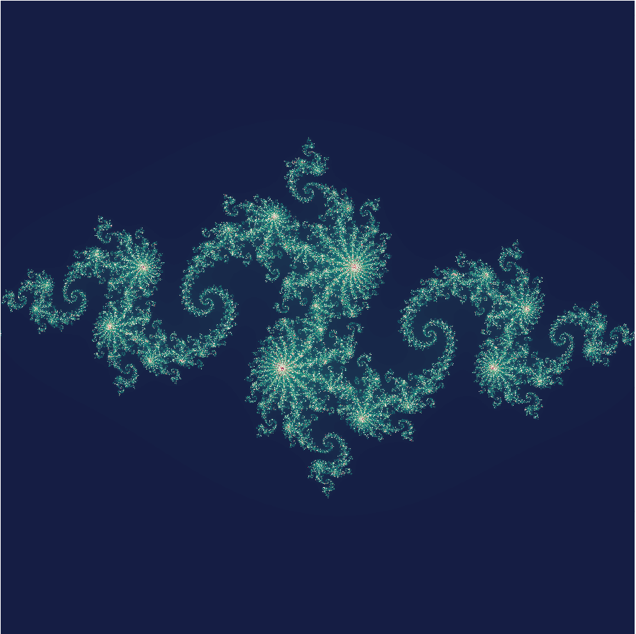

La geometría fractal es probablemente una de las ramas de las matemáticas más
llamativas visualmente. Las formas infinitamente complejas que resultan de estas
figuras (ubicuas en la naturaleza) son, además de bellas, clave en problemas de
maximización geométrica: por ejemplo, los pulmones maximizan el área de
absorción de oxígeno, y un frente de fractura maximiza el área de las nuevas
superficies libres creadas (que servirán para distribuir la energía extra que
provocó este cambio abrupto).

En este artículo se va a calcular uno de los conjuntos más clásicos dentro del
estudio de los fractales: los conjuntos de Julia.

## ¿Qué es un conjunto de Julia?

Comenzaremos con la definición de un conjunto de Julia lleno, que se define como
la región del plano complejo en el que la secuencia $z_{k+1} = f(z_k)$ es
convergente. Esta secuencia también puede describirse como $f^{(k)}$, y al
conjunto resultante se le denota por $K(f)$:

$$K(f) = \{ z \in\mathbb{C}\ :\ f^{(k)} (z)\not\to \infty \text{ cuando } k \to \infty \}.$$

Entonces, un conjunto de Julia ($J(f)$) se define como la frontera de $K(f)$:

$$J(f) = \partial K(f).$$

El conjunto $J(f)$ divide al plano complejo en dos regiones: los conjuntos de
Fatou (uno de los cuales está en $K(f)$), y el otro es el atractor del infinito,
$A_f(\infty)$).

El caso particular en el que $f(z) = z^2 + c$ es quizás el más estudiado (y
tiene íntima relación con el archiconocido conjunto de Mandelbrot), en cuyo caso
los conjuntos de Julia resultantes se llaman "conjuntos de Julia normales".

En este caso particular, se puede definir el conjunto $J(f)$ como:

$$J(f) = \left\{z \in \mathbb C : \forall n \in \mathbb N, |f_c^n(z)| \le 2 \right\}$$

Para este artículo nos vamos a centrar exclusivamente en conjuntos de Julia
normales y llenos.

## Implementación simple

La forma más directa de implementar el conjunto se basa en obtener la función
$z^2 +c$ (a poder ser con facilidad para cambiar la constante), una matriz que
será el dominio donde se evaluará la convergencia (se puede pensar en ello como
en una discretización de $\mathcal{C}$) y una función que hará la evaluación de
este dominio, devolviendo el número de iteraciones realizadas hasta la
divergencia de la serie (es decir hasta que $|f_c^n(z)| \le 2$), o en su defecto
un número máximo de iteraciones (se considera que si la serie alcanza este
máximo, es "convergente").

Para el primer requerimiento, se aprovecha la capacidad de julia para definir
funciones anónimas y funciones que devuelven funciones (en en términos
informáticos, una **clausura**):

```julia
function f_c(c::Complex)
  return z::Complex -> z^2 + c
end
```

La razón para usar esta opción frente a, por ejemplo, una función con variables
`z` y `c` es que (en principio) la función anónima que devuelve esta clausura es
compilada con la constante $c$ como una constante en código fuente, lo que es
más rápido que una variable. Asimismo, las funciones anónimas en julia no sufren
ninguna penalización en velocidad de ejecución (algo que es común en otros
lenguajes).

La discretización sencillamente usará unos parámetros de anchura, altura y
número de píxeles (`n` y `m`), y después se generará usando una *comprensión*:

```julia
width = [-1.5 1.5] 
height = [-1.5 1.5]
n = 1024
m = 1024
complex_grid = [complex(a,b)
    for a in range( width[1], length = n, stop =  width[2]),
        b in range(height[1], length = m, stop = height[2])];
```

En la función que calcule el conjunto, nos interesa principalmente llevar un
conteo de las iteraciones que se han hecho por cada punto.

Por ello, iterará la función hasta alcanzar un número máximo de iteraciones (en
cuyo caso se considerará que el punto es convergente, y por tanto pertenece a
$K(f)$), o hasta que se cumpla la condición $|f_c^n(z)| > r$, en cuyo caso se
guarda el número de iteraciones hasta la divergencia. El radio de escape *r*
puede aproximarse
[[1](http://mrob.com/pub/muency/escaperadius.html)],
[[2, ejemplo 3.8](http://citeseerx.ist.psu.edu/viewdoc/download?doi=10.1.1.48.2071&rep=rep1&type=pdf)]
como 2 para conjuntos de Julia normales.

```julia
function julia_set(f::Function, grid, maxiter = 10^3)
    n_matrix = zeros(size(grid))
    p=0
    for point in grid
        p += 1
        n = 0
        while (abs(point) <= 2 && n < maxiter)
            point = f(point)
            n += 1
        end
        n_matrix[p] = n
    end
    return n_matrix
end
```

Con estos ingredientes, podemos dibujar nuestro primer fractal:

```julia
using Plots

f = f_c(complex(-0.8,0.156))
J_f = julia_set(f, complex_grid)

cg = :curl
contour(J_f',
    fill=true,
    fillcolor = cg,
    aspect_ratio = 1,
    showaxis = false,
    legend=:none)
```



## Mejoras

Lo primero que cabe preguntarse es si se puede romper la función `julia_set` en
fragmentos más pequeños.
Por ejemplo, la función tiene dos partes: iterar sobre la malla y evaluar la
divergencia; por tanto, se puede extraer la funcionalidad de iterar $f$:

```julia
function compSequence(f::Function, z::Complex, maxiter::Int64 = 10^3)::Int64
    for n = 1:maxiter
        if (abs(z)>2)
            return n
        end
        z = f(z)
    end
    return maxiter
end
```

De este modo, se pueden usar funciones como `map` para hacer el cálculo sobre
cada punto del dominio de forma más cómoda:

```julia
@time J_f = map(z -> compSequence(f,z), complex_grid);
# 2.308717 seconds (2.48 M allocations: 91.058 MiB, 10.73% gc time)
```

También puede realizarse la paralelización del código:

```julia
using Distributed, SharedArrays; addprocs(4)

@everywhere function compSequence(...)
    # la función es igual que antes
```

Definiendo la función como `@everywhere`, todos los procesos tendrán acceso a
ella, por lo que realizando un bucle `for` con `@distributed` se realiza la
paralelización sobre el dominio con algunos cambios:

```julia
function mapSeq(f::Function, collection)
    output = SharedArray{Int64}(size(collection))
    @sync @distributed for ii in 1:length(collection)
        output[ii] = compSequence(f,collection[ii])
    end
    return output
end
```

Quizás lo más significativo es el uso de una `SharedArray`. Su utilización se
debe a la necesidad de hacer una asignación del valor de salida de
`compSequence`: sin una array compartida, el resultado se perdería.

Al igual que antes con `map`, podría usarse la función nativa
[pmap](https://docs.julialang.org/en/v1/stdlib/Distributed/#Distributed.pmap),
sin embargo no es conveniente para una función tan sencilla, ya que de la
documentación:

    Julia's pmap is designed for the case where each function call does a large
    amount of work. In contrast, `@distributed for` can handle situations where
    each iteration is tiny [...]

Y, si probamos a realizar el cálculo con `pmap` observaremos que:

```julia
@time pmap(z -> compSequence(f,z), complex_grid);
# 293.913520 seconds (104.60 M allocations: 4.290 GiB, 2.52% gc time)
```

Aunque antes no costaba mucho realizar las iteraciones sobre el conjunto, la
parelelización invita a intentar aprovechar algo más las capacidades de `Plots`,
por ejemplo a crear una animación con un $c$ variable: 

```julia
anim = @animate for a in 0:pi/450:2*pi
    f = f_c(complex(0.7885*exp(a*im)))
    J_f = mapSeq(f,complex_grid)
    contour(J_f',
        fill=true,
        fillcolor = :curl,
        aspect_ratio = 1,
        clim = (0,100),
        showaxis = false,
        legend=:none)
end

# se omite parte del directorio de salida
gif(anim,"\\figures\\julia_anim30.gif",fps=30)
```


Con esto se concluye el artículo, aunque el tema es realmente interesante (desde
el punto de vista informático también) y se retomará en el futuro.